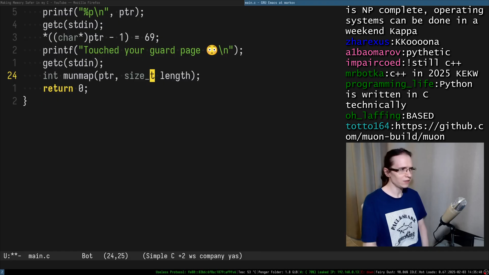

# SubChat

SubChat is a command-line and GUI toolset for generating YouTube subtitles from chat logs.

**IMPORTANT:** Currently, only YouTube in desktop browsers is supported.


Chat on this screenshot was created entirely using YouTube subtitles.

Screenshot from [Tsoding](https://www.twitch.tv/tsoding) stream.

## Project Components

The project has two separate targets:

- **config_generator_gui**: A GUI tool for creating and editing INI config files used by the subtitle generator.  
  *System Dependencies*: OpenGL, GLEW

  *Uses Submodules*: GLFW, Dear ImGui, TinyXML2, SimpleIni, Magic Enum, UTFCPP, nativefiledialog-extended.

 - **subtitles_generator**: A CLI tool that converts CSV chat logs into subtitle files (YTT/SRV3) using a given config file.  
  *Uses Submodules*: CLI11, TinyXML2, SimpleIni, Magic Enum, UTFCPP.

---

## CSV Format Specification

The input CSV file must follow this schema:

```
time,user_name,user_color,message
```

Where:

- `time`: Timestamp when the message was sent (in milliseconds or seconds, see `-u` flag)
- `user_name`: The display name of the user who sent the message
- `user_color`: Hex color code for the username (e.g., `#FF0000` for red)
- `message`: The actual chat message content

Example CSV:

```
time,user_name,user_color,message
1234567,User1,#FF0000,"Hello world!"
1235000,User2,,"Hi there!"
1240000,User1,#FF0000,"How are you?"
```

For example, you can download chat from Twitch VOD using https://www.twitchchatdownloader.com/

---

## Cloning the Repository

Clone the repository recursively to fetch all submodules:

```bash
git clone --recursive --shallow-submodules https://github.com/Kam1k4dze/SubChat
```

If already cloned without submodules:

```bash
git submodule update --init --recursive
```

---

## Building the Project

The project uses CMake (minimum required version 3.14) and is set up to build both targets. Note that OpenGL and GLEW are only needed for the GUI target.

### Steps to Build All Targets

1. **Create a build directory and navigate into it:**

   ```bash
   mkdir build && cd build
   ```

2. **Configure the project:**

   ```bash
   cmake ..
   ```

3. **Build everything:**

   ```bash
   cmake --build .
   ```

### Building Without GUI

If you only need the CLI tool and don't have OpenGL/GLEW installed:

```bash
cmake -DBUILD_GUI=OFF ..
cmake --build .
```

---

## Usage

### config_generator_gui

Launch this tool to generate or modify INI config files:

```bash
./config_generator_gui
```


### subtitles_generator

The CLI tool has two modes of operation:

#### 1. Convert Mode - Generate subtitle files

```bash
./subtitles_generator convert -c <config_path> -i <chat_csv_path> -o <output_file> -u <time_unit>
```

- `-h, --help`  
  Display help information and exit.

- `-c, --config`  
  Path to the INI config file.

- `-i, --input`  
  Path to the CSV file with chat data.

- `-o, --output`  
  Output subtitle file (e.g., `output.ytt` or `output.srv3`).

- `-u, --time-unit`  
  Time unit in the CSV: `"ms"` or `"sec"`.

#### 2. Config Creation Mode - Create config files from command line

```bash
./subtitles_generator create-config <output_file> [options]
```

Creates a new config file with the specified settings. All options have reasonable defaults.

**Basic Options:**
- `--bold` - Make text bold
- `--italic` - Make text italic  
- `--underline` - Make text underlined
- `--font-style <style>` - Font style (Default, Monospaced, Proportional, etc.)
- `--fg-color <hex>` - Text foreground color (e.g., "#FFFFFF")
- `--bg-color <hex>` - Text background color with alpha (e.g., "#00000080")
- `--edge-color <hex>` - Text edge color (e.g., "#000000")
- `--edge-type <type>` - Edge type (None, HardShadow, Bevel, GlowOutline, SoftShadow)
- `--text-align <align>` - Text alignment (Left, Right, Center)

**Layout Options:**
- `--font-size <size>` - Font size percent (0-300)
- `--h-margin <margin>` - Horizontal margin (0-100)
- `--v-margin <margin>` - Vertical margin (0-100)
- `--v-spacing <spacing>` - Vertical spacing between lines
- `--display-lines <count>` - Total number of lines to display
- `--max-chars <count>` - Maximum characters per line
- `--username-sep <separator>` - Username separator

**Example:**
```bash
./subtitles_generator create-config my_config.ini --bold --font-style Monospaced --fg-color "#00FF00" --edge-type SoftShadow --display-lines 10
```
